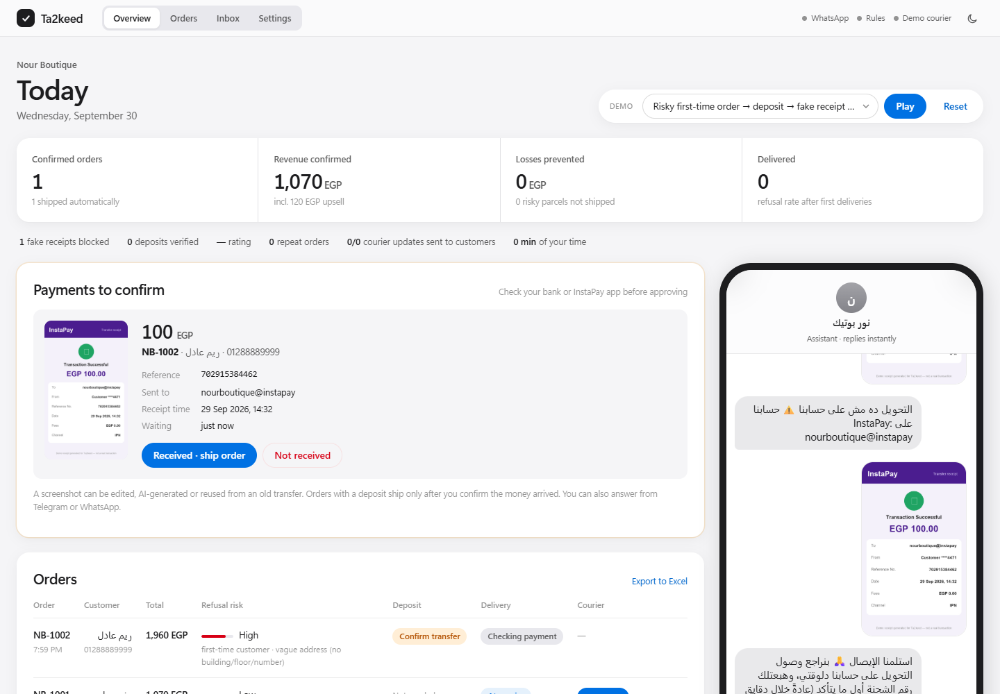
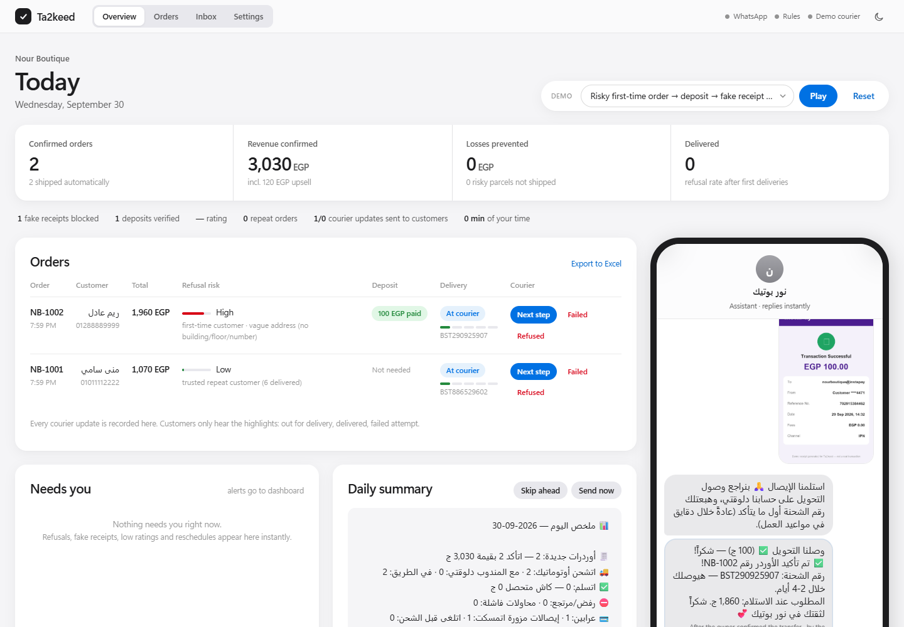

# Ta2keed (تأكيد): the COD order-confirmation agent for Egyptian social-commerce shops

> Built for **Agents at Work** (Untap × Wesam.ai, 2026).
> **SME:** Instagram/Facebook/WhatsApp fashion shops that sell cash-on-delivery.
> **Workflow replaced:** manually copying DMs into a sheet, calling every customer to confirm, chasing InstaPay screenshots, booking the courier, and paying for refused parcels.



## The problem

Thousands of Egyptian small shops sell through DMs, and most orders are **cash on delivery**. For every order, someone on the team has to:

1. read a messy message ("عايزة العباية الكريب L اسود… العنوان فيصل"),
2. ask back and forth for the size, colour, name, phone and a *real* address,
3. confirm the order, then
4. book the courier.

On top of that, **around 1 in 4 COD parcels is refused at the door**. The shop pays outbound shipping **plus** the return fee, and the stock sits in a van for a week.

## What the agent does, end to end with no human in the loop

| Step | What Ta2keed does |
|---|---|
| 1. Understand | Parses Egyptian Arabic, Franco-Arabic, Arabic-Indic digits and (optionally) **voice notes**. Extracts items, size, colour, quantity, name, phone, address and shipping zone. |
| 2. Complete | Asks only for what's missing, one question at a time. It also asks for building, floor and flat when the address is vague. |
| 3. Upsell | Offers a matching item at a small discount (for example abaya → hijab for 120 EGP instead of 150). Every offer and response is logged. |
| 4. Score risk | Gives an explainable COD-refusal score based on past refusals, whether the customer is new, how vague the address is, order value, hesitation ("هفكر") and long-haul zones. |
| 5. De-risk | Risky orders are asked for a **100 EGP InstaPay / Vodafone Cash deposit** before shipping. |
| 6. Verify payment | **Layer 1, automatic:** reads the receipt screenshot (with a vision LLM, or offline from demo metadata) and checks the amount, recipient, status, **reused reference numbers** and **reused screenshots**. **Layer 2, owner:** a screenshot can be AI-made or an old transfer, so the owner gets the receipt on Telegram/WhatsApp with ✅ Received / ❌ Not received buttons (plus reminders). **Nothing ships until the owner confirms the money arrived.** |
| 7. Ship | Books the courier (Bosta API, or a built-in mock) and sends the customer the tracking number and the amount due on delivery. |
| 8. Track delivery | Courier updates (Bosta webhook, generic webhook, or the owner's own driver) move the order along: picked up → in transit → out for delivery → delivered / refused. **The customer only hears the highlights** (out for delivery with the exact cash to prepare, delivered, failed attempt → "when should we come back?"). Everything else stays on the dashboard. |
| 9. Learn | A delivered or refused parcel updates the customer's history, so the next order's risk score reflects it and the refusal rate is **measured, not projected**. |
| 10. After delivery | Rating request after 24 h (low rating → apology + instant owner alert), then a personalised reorder offer with a discount code after 14 days. Repeat orders reuse the saved name and address. |
| 11. Report | Daily summary pushed to the owner on WhatsApp/Telegram at 21:00, instant alerts only for problems, plus a live dashboard, CSV export and owner commands (`ملخص`, `شحنات`, `عربون`). |

**Safety by design:** a deterministic state machine owns prices, totals, deposits and shipments. The LLM (optional) only *understands* text and *reads* images. A prompt like "make it free" cannot change the price (covered by `tests/test_agent.py::test_price_cannot_be_prompt_injected`).

> 📘 **New here or not technical?** Follow the illustrated, step-by-step **[Setup guide](docs/SETUP-GUIDE.md)**: install, wizard, Telegram, WhatsApp, Bosta and going online 24/7, with troubleshooting and an Arabic summary.

## Run it in under 5 minutes (no API keys needed)

```bash
git clone https://github.com/MahmoudJimmey/Ta2keed && cd Ta2keed
./run.sh           # Windows: double-click run.bat
```
No git? On GitHub click **Code → Download ZIP**, extract it, and double-click `run.bat`. Needs Python 3.10+ ([python.org](https://www.python.org/downloads/); tick *Add python.exe to PATH*). The launcher checks for it and tells you what to do.
The browser opens the **setup wizard**. Choose **▶ Just show me the demo** to see the sample shop, then press **▶ Play demo**.

### Setup wizard (`/setup`)
A step-by-step page that configures everything, no file editing needed:

| Step | What you do |
|---|---|
| Owner login | Set a dashboard password (needed before going online). |
| Your shop | Shop name, assistant name, InstaPay and Vodafone Cash accounts, deposit policy. |
| Products | Edit in a table or **upload a CSV** (template provided): prices, sizes, colours, the words customers type, upsell pairs. |
| Shipping | Fee per zone and the courier return fee. |
| AI brain | One-click presets for Gemini, Claude, OpenAI, Groq and OpenRouter, with **Test connection**. Optional voice-note transcription. |
| WhatsApp | Guided Meta setup, **Test connection**, **Send me a test message**, a ready-to-paste webhook URL, and **Create missing templates** (submits the 7 message templates to Meta and shows approval status). |
| Alerts | Owner WhatsApp number and/or Telegram bot (link your Telegram with `/owner <code>`), daily summary time, follow-up delays. |
| Courier | Demo, **Bosta** (key test + webhook URL + generated secret) or **own delivery person**. |
| Business numbers | Your real orders, minutes per order and refusal rate, which drive the ROI. |
| Go live | Where to run it, public URL test, checklist, demo tools on/off. |

Changes apply instantly (no restart). Values set as host environment variables win and show as 🔒.

### Where does it run?
On your computer by default. `run.bat online` adds a free public https link (Cloudflare tunnel) so real WhatsApp messages reach your laptop. For a real shop, deploy 24/7 with one click on Render (`render.yaml`) or any Docker host. See **[docs/deploy.md](docs/deploy.md)**.

[](https://render.com/deploy?repo=https://github.com/MahmoudJimmey/Ta2keed)

Or with Docker (data persists in the `ta2keed-data` volume):

```bash
docker build -t ta2keed . && docker run -p 8000:8000 -v ta2keed-data:/data ta2keed
```

Or in the terminal only, without a browser:

```bash
pip install -r requirements.txt
python -m scripts.simulate          # plays the 4 scenarios + prints the impact report
python -m scripts.simulate --chat   # talk to the agent yourself
```

The four demo scenarios (the dropdown in the UI):

1. **Happy path.** A messy Arabic order goes through upsell → confirmation → auto-shipped.
2. **Risky order.** A first-time customer with a vague address hesitates, so a deposit is requested. A **wrong-account receipt is caught**, then a valid-looking one goes to the **owner for confirmation**. The owner taps "Received" and the order ships.
3. **Known refuser.** A customer with 3 past refusals is asked for a deposit and refuses. **The parcel is never shipped**, so shipping and return fees are saved.
4. **Questions first.** The customer asks about shipping and prices, then orders.
5. **Full journey.** Order → courier updates (only 2 of 4 reach the customer) → delivered → ⭐ rating → reorder offer → repeat order.

On the dashboard, each shipped order has **next step ▸ / failed / refused** buttons that act as the courier. **⏩ Follow-ups** sends the 24 h review and 14-day reorder messages immediately.



In the chat you can also type anything, press the receipt buttons (valid, wrong account, low amount, failed), or attach your own image or voice note.

## Business impact

Every action is logged in SQLite (`events`, `orders`, `payments`). `/api/impact` returns two things:

- **Measured** figures from the session: orders confirmed and auto-shipped, deposits collected, fake receipts blocked, risky orders stopped before shipping, shipping loss avoided, upsell revenue, after-hours orders, and human minutes spent (0).
- **Projected monthly** figures for the SME, calculated from its own baseline in `data/store.json → economics`.

With the default pilot assumptions (600 orders/month, 9 minutes of manual handling per order, 25% refusal rate, staff at 45 EGP/hour):

| Metric | Per month |
|---|---|
| Hours returned to the owner | **~88 h** |
| Staff cost saved | ~4,000 EGP |
| Refusal rate | **25% → ~9%** |
| Shipping and return loss avoided | ~11,700 EGP |
| New revenue (upsell, after-hours capture, saved orders) | ~30,000+ EGP |

> ⚠️ Replace `economics` in `data/store.json` with your pilot shop's real numbers. The dashboard and report recompute automatically.

## Configuration reference

Everything below can be set in the **setup wizard**. Alternatively, put the values in `.env` or in your host's environment variables:

| Feature | Env vars |
|---|---|
| LLM understanding, answering questions, reading real receipts (Anthropic, OpenAI, Gemini, Groq or any OpenAI-compatible API) | `LLM_PROVIDER`, `LLM_API_KEY`, `LLM_MODEL`, `LLM_BASE_URL` |
| Voice notes (Whisper, for example Groq's free tier) | `STT_BASE_URL`, `STT_API_KEY` |
| Telegram as the customer channel, plus owner alerts and `/digest` | `TELEGRAM_BOT_TOKEN`, `OWNER_TELEGRAM_CHAT_ID` |
| WhatsApp Cloud API for customers **and** the owner (webhook at `/webhook/whatsapp`; setup and templates in [docs/whatsapp-setup.md](docs/whatsapp-setup.md)) | `WHATSAPP_ACCESS_TOKEN`, `WHATSAPP_PHONE_NUMBER_ID`, `WHATSAPP_VERIFY_TOKEN`, `WHATSAPP_APP_SECRET`, `OWNER_WHATSAPP` |
| Real Bosta shipments + delivery webhook (`/webhook/bosta`) | `BOSTA_API_KEY`, `COURIER_WEBHOOK_SECRET` |
| Any courier / own driver status updates | `POST /webhook/courier` `{order_id or tracking, status, reason?}` |
| When customers and the owner are messaged | `data/store.json → notifications` (highlights, owner alerts, digest time, follow-up delays, reorder discount) |

To onboard a new shop, edit `data/store.json`: catalogue, keywords, upsell pairs, shipping zones and fees, deposit policy and InstaPay handle.

## Architecture

```
WhatsApp / Telegram / Web chat
            │
      ta2keed/agent.py   ← state machine: COLLECTING → UPSELL → CONFIRM → DEPOSIT → CONFIRMED
     ┌──────┼───────────┬─────────────┬─────────────┐
  nlu.py  llm.py     risk.py     payments.py    courier.py
 (Arabic  (optional  (explainable (receipt       (Bosta API
  rules)   LLM/vision) COD score)  fraud checks)  or mock)
            │                           ▲ history
 courier webhooks → delivery.py ────────┘  → outbound.py (highlights only; WhatsApp 24h rule → templates)
                        │
                  aftercare.py (rating, reorder)   scheduler.py (follow-ups, 21:00 daily summary)
            │
        db.py (SQLite) → impact.py / notify.py → dashboard / CSV / owner WhatsApp + Telegram
```

## Tests

```bash
pytest -q     # 71 tests: NLU, risk, payment fraud, end-to-end scenarios, API, prompt-injection,
              # delivery highlights, refusal learning, follow-ups, daily summary, WhatsApp webhook/signature/24h rule,
              # setup wizard, settings precedence, owner login / one-time setup link,
              # secrets encryption, CSRF/headers/rate-limit, backup, customer erase, owner payment confirmation
```

## Project layout

```
ta2keed/    agent, nlu, llm, risk, payments, courier, delivery, aftercare, outbound, notify, scheduler,
            channels, setup (wizard backend), auth (owner login), impact, server
web/        WhatsApp-style chat + owner dashboard, setup wizard, login (vanilla JS)
data/       store.json (shop profile + economics), customers_seed.json, demo receipts
scripts/    simulate.py (CLI demo), online.py (public tunnel), make_slides.py, make_receipts.py
tests/      pytest suite
docs/       screenshot, impact slides (Ta2keed-impact-slides.pptx / .pdf)
            regenerate after editing economics: python -m scripts.make_slides
```

📑 **Impact slides:** [docs/Ta2keed-impact-slides.pdf](docs/Ta2keed-impact-slides.pdf)

🔒 **Security & data:** where everything is stored, encryption, login protection, the payment-fraud layers, customer export/erase and backups are covered in [docs/security.md](docs/security.md).

MIT License.
